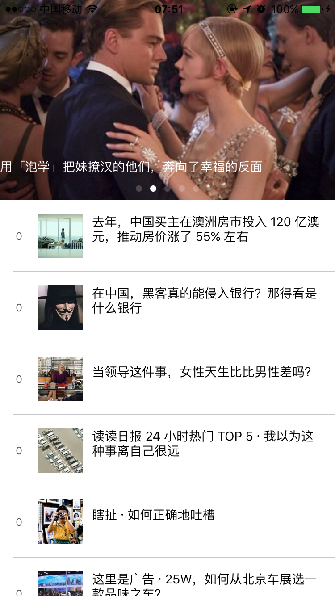

# README

<!--
create time: 2016-04-27 07:53:17
Author: amoblin

This file is created by Marboo<http://marboo.io> template file $MARBOO_HOME/.media/starts/default.md
本文件由 Marboo<http://marboo.io> 模板文件 $MARBOO_HOME/.media/starts/default.md 创建
-->

Zhizhi is a ZhiHu iOS client. it use DDBrick and WANetwork for quick development.

